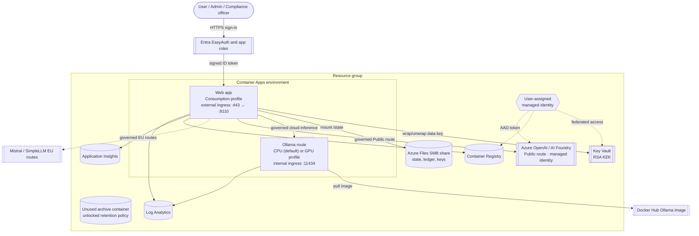
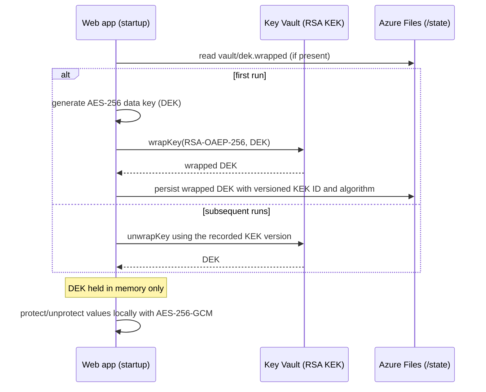

# PDA on Azure — Architecture

This document describes the Azure hosting architecture for the PDA governance demo:
the Node.js Copilot-SDK agent, its confidentiality/sovereignty governance, and its
signed append-only compliance ledger, deployed to Azure Container Apps with
Infrastructure as Code (Bicep + Azure Verified Modules).

> The original application is a Windows, loopback-only local demo. The Azure target
> keeps that local mode intact and adds a cloud mode that is enabled only through
> environment variables (see [Runtime configuration](#runtime-configuration)).

## Contents

- [PDA on Azure — Architecture](#pda-on-azure--architecture)
  - [Contents](#contents)
  - [Component overview](#component-overview)
  - [Topology diagram](#topology-diagram)
  - [Request and inference flow](#request-and-inference-flow)
  - [Data at rest and encryption](#data-at-rest-and-encryption)
  - [Ledger observability (OpenTelemetry)](#ledger-observability-opentelemetry)
  - [Identity and access](#identity-and-access)
  - [Networking and ingress](#networking-and-ingress)
  - [Azure Verified Modules used](#azure-verified-modules-used)
  - [Runtime configuration](#runtime-configuration)
  - [Design decisions and honest limitations](#design-decisions-and-honest-limitations)

## Component overview

| Component | Azure service | Purpose |
| --- | --- | --- |
| Web app (governance agent) | Azure Container Apps (Consumption profile) | Serves the chat/Admin/Compliance UI and the governed agent loop |
| Cloud Public model route | Azure OpenAI / AI Foundry | Serves the Public route via **managed identity** (no key, no personal sign-in) |
| Azure Ollama route | Azure Container Apps (CPU Consumption profile by default; optional serverless GPU) | Cloud-hosted inference, internal ingress only; cannot satisfy on-premises requirements |
| At-rest key material | Azure Key Vault | RSA key-encryption key (KEK) that wraps the app data-encryption key |
| Live state | Azure Storage — Azure Files (SMB) | Persists signing key, ledger, checkpoint and secrets across revisions |
| Archive placeholder | Azure Storage — Blob | Unused container with an unlocked retention policy; no uploader or immutable evidence |
| Container image | Azure Container Registry | Stores the web image; pulled with managed identity |
| Workload identity | User-assigned managed identity | Key Vault, ACR and Azure OpenAI access; Azure Files uses an SMB account key |
| Telemetry | Log Analytics + Application Insights | Platform logs and an explicit non-authoritative ledger log mirror |

## Topology diagram

The configured local Copilot route uses personal sign-in; this implementation does
not provision that authentication in Container Apps. In cloud mode it is disabled,
and the Public route is served by **Azure
OpenAI via managed identity**. Copilot remains a local-only route. See
[limitations](#design-decisions-and-honest-limitations).

## Request and inference flow

1. A browser request reaches the **web app** over HTTPS via the Container Apps external
   ingress (TLS terminates at ingress; traffic forwards to container port `8110`).
2. EasyAuth requires Entra sign-in. The server independently verifies the forwarded
  ID token's signature, issuer, audience, expiry and tenant, enforces application
  roles, validates Host and same-origin, and binds chat ownership to identity and
  the browser capability. A cookie or unsigned principal header grants no cloud authority.
  EasyAuth also applies its own cross-site-request-forgery mitigation, which rejects a
  session-authenticated `POST` whose `Origin` is not approved; the web app's own FQDN is
  therefore listed in `login.allowedExternalRedirectUrls`, otherwise every browser API
  write returns an empty `403`.
3. For non-Copilot routes the SDK is pointed at an **in-process proxy**
   (`/internal/model/<token>/v1`) on the same container, which performs the actual,
   policy-checked egress:
   - **Public** → Azure OpenAI using managed identity.
   - **Permitted cloud workload** → Ollama only if host and route geography satisfy policy.
   - **On-premises / country-restricted fixture** → refusal, not cloud inference.
   - **EU** → Mistral or SimpleLLM (declared EU endpoints; location is a provider
     declaration, not attested execution).
4. Authorization, egress, fallback and tool decisions are appended to the signed
   ledger on the Azure Files mount.

Refusal occurs after the prompt reaches the cloud web server and can be recorded.
This is a synthetic-data demo, not an ingress control for real on-premises-only data.

## Data at rest and encryption

The original app encrypts secrets and the Ed25519 signing key with **Windows DPAPI**,
which is unavailable on Linux. The Azure build replaces DPAPI with **envelope
encryption backed by Key Vault**, implemented in `app/protector.mjs`:

- Only the one-time wrap/unwrap of the data key touches Key Vault; per-value
  `protect`/`unprotect` stay local and synchronous, preserving the storage layer's
  synchronous contract.
- Only secrets and signing-key material receive application envelope encryption;
  chats, settings and ledger records remain application-readable JSON on Azure Files.
  Azure Storage service encryption is separate from this application protection.
- The archive is provisioned but unused. No uploader runs and the retention policy
  is not locked. This implementation does not establish immutable archived evidence.
- Legacy unversioned DEKs fail closed and require an approved recovery/migration.
  Keep the recorded KEK version available; rotating to a newer version does not
  automatically rewrap or migrate existing state.
- Blob **versioning**, **change feed** and **soft-delete** are enabled for recovery.

## Ledger observability (OpenTelemetry)

The signed append-only ledger is the **system of record**. When `PDA_OTEL_ENABLED=1`
(default in cloud, off locally), each ledger append is also emitted as an
**OpenTelemetry log record** to Application Insights via `app/telemetry.mjs` — a
**non-authoritative mirror** for dashboards, alerting and trace correlation.

- The mirror is best-effort through an optional `onAppend` hook. Projection and
  queueing add synchronous overhead; network exports use a bounded queue and may
  drop records. Export failures do not invalidate the authoritative ledger.
- Only an explicit **allow-list** of non-sensitive fields is exported (`seq`, `kind`,
  `digest`, `previousHash`, `routeId`, `outcome`, `level`, `sovereignty`,
  `policyVersion`, ...). Signatures, secrets, prompts, tool arguments/results and
  credentials are never sent.
- Only the explicit log exporter is initialized: no HTTP auto-instrumentation,
  request URLs or free-text reasons. Offline exporter storage is disabled. Metadata
  is still potentially sensitive; approve its destination, access and retention.
- Compliance is verified from the ledger (`verifyLedger()`); OpenTelemetry is for
  monitoring only.

## Identity and access

A single **user-assigned managed identity** is attached to both container apps.
Role assignments (provisioned via AVM `roleAssignments`):

| Target | Role | Why |
| --- | --- | --- |
| Key Vault | Key Vault Crypto User | wrap/unwrap the data-encryption key |
| Key Vault | Key Vault Secrets User | read any future KV-sourced secrets |
| Container Registry | AcrPull | pull the web image; Ollama currently uses Docker Hub |
| Storage account | Storage Blob Data Contributor | Provisioned archive permission, not an active upload flow |
| Azure OpenAI | Cognitive Services OpenAI User | call the Public-route model with the managed identity |
| Key Vault | Key Vault Secrets Officer | *(optional)* granted to the CI principal when `deployerPrincipalId` is supplied |

`AZURE_CLIENT_ID` is set on the web app so `DefaultAzureCredential` selects this
identity. Provider API keys and signing keys are envelope-protected in state;
EasyAuth uses Container Apps secrets for its login credential and token-store SAS.
User authentication is separate from this workload identity. Assign Entra app roles
`User`, `Administrator`, and `Compliance`; missing roles are denied. Existing Azure
OpenAI accounts need an explicit operator-managed role assignment.

## Networking and ingress

- **Web app**: external ingress, HTTPS only (`ingressAllowInsecure: false`), target
  port `8110`. The app's `Host`/`Origin` guards are configured for the Container Apps
  FQDN via `PDA_ALLOWED_HOSTS` and `PDA_PUBLIC_SCHEME=https`.
- **Ollama app**: internal ingress only (not internet-reachable), target port `11434`.
  The web app reaches it at `https://<ollama-fqdn>/v1` inside the environment. It
  scales to zero by default, and its startup downloads the model, so the first
  request after idle exceeds the bounded provider attempt and is refused. Set
  `ollamaMinReplicas=1` to keep it warm at GPU cost.
- **Health probe**: `/healthz` is exempt from the host/origin guards so Container Apps
  liveness/readiness checks succeed regardless of the probe's `Host` header.
- **Storage and Key Vault reachability**: the environment is **not** VNet-injected, so
  the state and token-store storage accounts are reached over their public endpoints
  with the SMB account key, and Key Vault over its public endpoint. The templates enable
  shared-key and public network access and set `networkAcls.defaultAction` to `Allow` on
  the storage accounts. Every resource and the resource group is tagged
  `SecurityControl: Ignore` so a subscription's storage-hardening Azure Policy (disable
  shared key / public access / default-deny) exempts them; without that exemption the SMB
  mount and Key Vault access fail closed (`VolumeMountFailure: mount error(13)`).
- **Single web replica** (`minReplicas = maxReplicas = 1`) because the append-only
  ledger must not be written concurrently. This setting alone does not prevent
  overlapping revisions: an exclusive filesystem lock is also required. Deployment
  scripts deactivate old revisions before updating, with downtime. During a rolling
  redeploy the incoming revision waits (up to 120 s in cloud mode) for the previous
  writer to release the lock on graceful shutdown; it never force-reclaims or
  age-deletes a held lock, so a genuinely stale lock still needs verified operator
  recovery.

## Azure Verified Modules used

| Module | Version |
| --- | --- |
| `avm/res/managed-identity/user-assigned-identity` | 0.6.0 |
| `avm/res/operational-insights/workspace` | 0.16.1 |
| `avm/res/insights/component` | 0.8.0 |
| `avm/res/container-registry/registry` | 0.13.0 |
| `avm/res/key-vault/vault` | 0.14.0 |
| `avm/res/storage/storage-account` | 0.33.0 |
| `avm/res/app/managed-environment` | 0.16.0 |
| `avm/res/app/container-app` | 0.23.0 |
| `avm/res/cognitive-services/account` | 0.19.0 |

The archive container's retention policy is applied as a raw
`Microsoft.Storage/storageAccounts/blobServices/containers/immutabilityPolicies`
resource, since the storage module does not expose it directly. It is created
unlocked, so it can still be shortened or removed, and nothing writes to the
container. Locking is a deliberate, irreversible operator decision that this
template does not make.

## Runtime configuration

Environment variables consumed by the app (set on the web container by Bicep):

| Variable | Local default | Cloud value | Effect |
| --- | --- | --- | --- |
| `PDA_ALLOW_REMOTE` | unset | `1` | Enables non-loopback bind, HTTPS scheme and the host allow-list |
| `PDA_PROTECTOR` | `dpapi` (Windows) | `keyvault` | Selects the at-rest protector |
| `AZURE_KEY_VAULT_URI` | — | vault URI | Key Vault used for the KEK |
| `PDA_KEK_NAME` | `pda-kek` | `pda-kek` | Name of the wrapping key |
| `AZURE_CLIENT_ID` | — | UAMI client ID | Identity for `DefaultAzureCredential` |
| `PDA_STATE_DIR` | `%LOCALAPPDATA%/PDA/...` | `/state` | State directory (Azure Files mount) |
| `PDA_DEPENDENCIES` | local dep root | `/app` | Where the Copilot SDK is loaded from |
| `PORT` | `8110` | `8110` | Listen port (kept at 8110 so the internal proxy works) |
| `PDA_PUBLIC_SCHEME` | `http` | `https` | Scheme used in the same-origin check |
| `PDA_ALLOWED_HOSTS` | — | web FQDN | Extra hostnames accepted in the `Host` header |
| `PDA_OLLAMA_BASE` | loopback | internal Ollama URL | Configured inference endpoint, not proof of sovereignty |
| `PDA_OLLAMA_MODEL` | `qwen2.5:7b` | same tag as Ollama container | Model selection |
| `PDA_HOST_GEOGRAPHY` | on-premises | `Public cloud` or reviewed `EU-only` | Host residency ceiling |
| `PDA_AUTH_TENANT_ID`, `PDA_AUTH_CLIENT_ID` | unset | required GUIDs | Tenant and audience for signed user ID tokens |
| `PDA_INTERNAL_BASE` | `http://127.0.0.1:8110` | same | Base for the in-process model proxy |
| `PDA_OTEL_ENABLED` | unset | `1` | Emit the non-authoritative OpenTelemetry ledger mirror |
| `APPLICATIONINSIGHTS_CONNECTION_STRING` | — | AI connection string | Telemetry export target |
| `PDA_PUBLIC_ROUTE` | `copilot` | `azure` | Which route serves the Public level by default |
| `AZURE_OPENAI_ENDPOINT` | — | AOAI v1 endpoint | Azure OpenAI base URL for the Public route |
| `AZURE_OPENAI_DEPLOYMENT` | `gpt-4.1-mini` | deployment name | Model deployment used as the route model |

Local mode remains a trusted-workstation demo, fixed to loopback port 8110. Its
updated runtime requires Node 22.12 or later and exclusive state ownership.

## Design decisions and honest limitations

- **Copilot route in cloud**: the Public → Copilot route needs an interactive Copilot
  sign-in that this deployment does not configure. In Azure the Public route is served
  by **Azure OpenAI via the managed identity** (set `PDA_PUBLIC_ROUTE=azure` with an
  `AZURE_OPENAI_ENDPOINT`); Copilot remains a local-only route. The Azure OpenAI
  account uses AAD-only auth (`disableLocalAuth: true`) — no keys are stored.
- **Ollama compute profile**: the Ollama route runs CPU-only on the Consumption
  profile by default (`ollamaUseGpu = false`, no GPU quota needed but slower CPU
  inference). Set `ollamaUseGpu = true` to run it on a serverless GPU profile, which
  requires GPU quota and regional availability; the chosen profile type and the
  container CPU/memory must be compatible or the deployment fails. The Consumption
  profile caps at 4 vCPU / 8Gi, so a large model may need a smaller tag on CPU.
- **Container image**: the runtime image installs `ca-certificates`. The Copilot SDK's
  native (Rust) HTTP client loads the system CA trust store to make outbound TLS calls,
  and the `-slim` base image omits it, so without that layer every model turn fails with
  "No CA certificates were loaded from the system".
- **EU sovereignty**: Mistral/SimpleLLM endpoints are provider declarations, not
  independently attested execution locations.
- **Immutability**: neither a locked archive nor an upload workflow is implemented.
  The live ledger is signed and tamper-evident, not immutable storage. Independent
  archival/retention approval remains work before claiming production compliance.
- **Statefulness**: the design assumes a single web replica for ledger integrity; it is
  not horizontally scaled.
- **Verification**: a live Azure deployment has been exercised — Entra sign-in with app-role
  isolation, Key Vault KEK access, the Azure Files (SMB) state mount and the Azure OpenAI
  Public route reaching the model (a governed tool call required adding a `required` array to
  the strict tool schemas). GPU, the EU provider routes, telemetry delivery and recovery paths
  were not exercised. See the deployment guide's Troubleshooting for the issues found and fixed.
